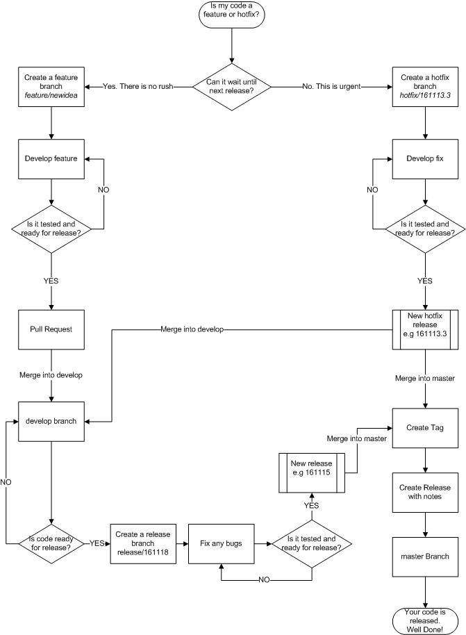

# Branching and Pull Requests

LinuxGSM has now moved from a rolling release to scheduled releases. This is due to the size of the project and the requirement to better manage features and bug fixes.

## GitFlow

LinuxGSM uses the GitFlow method \(mostly\) of releases. Relying on `master`, `develop`, `feature` and `hotfix` branches.


For further reading on the GitFlow model read the following article.



## LinuxGSM Feature Flowchart

The below flow chart highlights the basic method for getting a feature released.



## Branches

The `master` branch will be the stable release branch. The `develop` branch is for developing stable code. All code is to be developed in a `feature` branch or `hotfix` for urgent fixes. 

### Master

The `master` branch is where the stable release is kept. Only code that has gone via the `develop` can be merged here and goes through a release process. It is very important that code there has been tested and is stable as it is used in production.

### Develop

The `develop` branch brings together all the `feature` branches ready to be tested to become the next stable release. Developers should use `develop` as the base when creating a branch. 

### Feature

A feature branch is a development branch that is used while code is being actively worked on by developers. A feature branch should normally relate to an existing issue in GitHub. The feature branch should refer to the issue number and a word or two describing the issue, allowing other developers to know what issue branch related to and helps with housekeeping.

```text
feature\1234-glibc-migrate
```

Once a feature is ready to be merged in to `develop` a pull request is to be raised to allow the feature to be reviewed.


The branch naming convention is less of an issue for developers who have forked the project and submitted a pull request. However, it is recommended that the standard is used.


### Hotfix

The `hotfix` branch is identical to the `feature` branch but instead is used for urgent fixes that need to be applied to master.

```text
hotfix\1234-glibc-migrate
```

### Release

When code from the `develop` branch is ready for release it is split off into a `release` branch. 

The `release` branch will not have any more features added to it. It is then tested and any bugs fixed it will be released into `master` and tagged as a version number. The release will also be merged back into the `develop` branch.

It is also a good idea to start using [Git Kracken](https://www.gitkraken.com/) as the git client. It is a little more complex that GitHub Desktop but will give you a much better understanding of the development process.

## Pull Requests

Pull Requests \(PR\) let others review changes a developer has been making in a branch. Once a PR is opened, a branch can be reviewed with other developers giving feedback and also add follow-up commits \(LinuxGSM core devs only\) before changes are merged into the base branch.

LinuxGSM uses Pull Requests to allow developers to submit code that is ready or nearly ready to be merged into the `develop` branch. To make the process easier a checklist template has been created to guide the submission.

Various unit tests are carried out to check that the PR does not break LinuxGSM and follows standards. Feedback is given by the tests once they are completed.

If the PR is not quite ready for merge but is ready for review and feedback ensure the subject of the PR conains `[WIP]`\(Work in Progress\).

