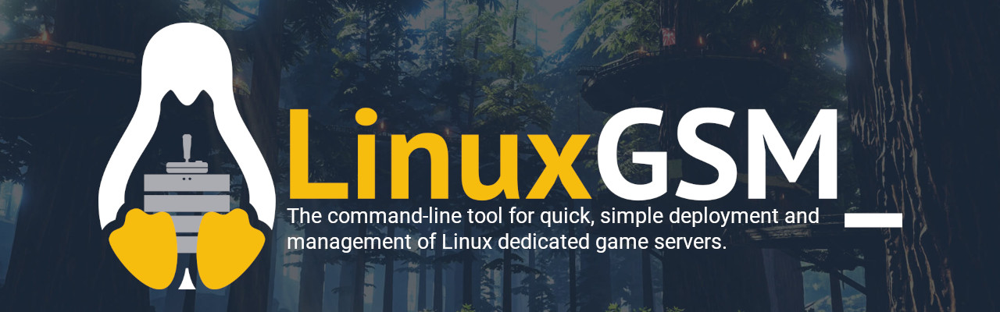

# Getting Started

<figure><figcaption></figcaption></figure>

## Intro

This guide will give a brief overview of how to get started developing LinuxGSM by running through some of the basics of using GitHub and the tools you need. This is not a comprehensive guide to GitHub but should help with getting started. There are plenty of resources available online such as the [GitHub help documentation](https://help.github.com/en/github) and [guides](https://guides.github.com/) that will help you learn more.

## Choosing an Issue to Develop

Whenever someone raises a new feature request or bug is done on the [GitHub Issues](https://github.com/GameServerManagers/LinuxGSM/issues) page. There is a raft of issues with different levels of complexity. Choosing an issue to work on is down to you as an individual, however, it is important you enjoy working on it.&#x20;

When reviewing an issue it is a good idea to look at factors such as complexity, scope, and time to develop.&#x20;

It is recommended that a simple issue is picked first as they are more likley to be merged quickly.

Popular issues to attempt are [type:Server Requests](https://github.com/GameServerManagers/LinuxGSM/issues?q=is%3Aissue+is%3Aopen+label%3A%22type%3A+server+request%22) as often developers want to have a game server added to the project. Be warned however some game servers can be more difficult than others to develop.

To help filter issues GitHub uses [labels](https://help.github.com/en/github/managing-your-work-on-github/about-labels) to help identify the types of issues. Common labels include `type:bug`, `type:feature`, `command:monitor`, `game: 7 Days to Die`. Labels are split into label types such as type, command, game, and info to aid in prioritising and managing them.

## Starting Development

To begin working on LinuxGSM you need to [fork](https://help.github.com/en/github/getting-started-with-github/fork-a-repo) the LinuxGSM repository once forked you will need to [clone](https://help.github.com/en/github/creating-cloning-and-archiving-repositories/cloning-a-repository-from-github) your new repository to your local machine using your chosen git client. Once cloned it is possible to edit the code on your local machine using your text editor of choice.

It is recommended you create a [branch](../@linuxgsm/s/linuxgsm-dev/branching/) to develop your code. The branch should use the Gitflow methodology and should be named `feature/[featurename]`.

Once a change has been made and saved the change will need to be committed to your local repo. When using commit it is important to leave a useful message to describe the change, this is covered in [Conventional Commits](../@linuxgsm/s/linuxgsm-dev/conventional-commits/). When you are ready to send your commits to your remote fork you will need to [push ](https://help.github.com/en/github/using-git/pushing-commits-to-a-remote-repository)the updates.

##

##
